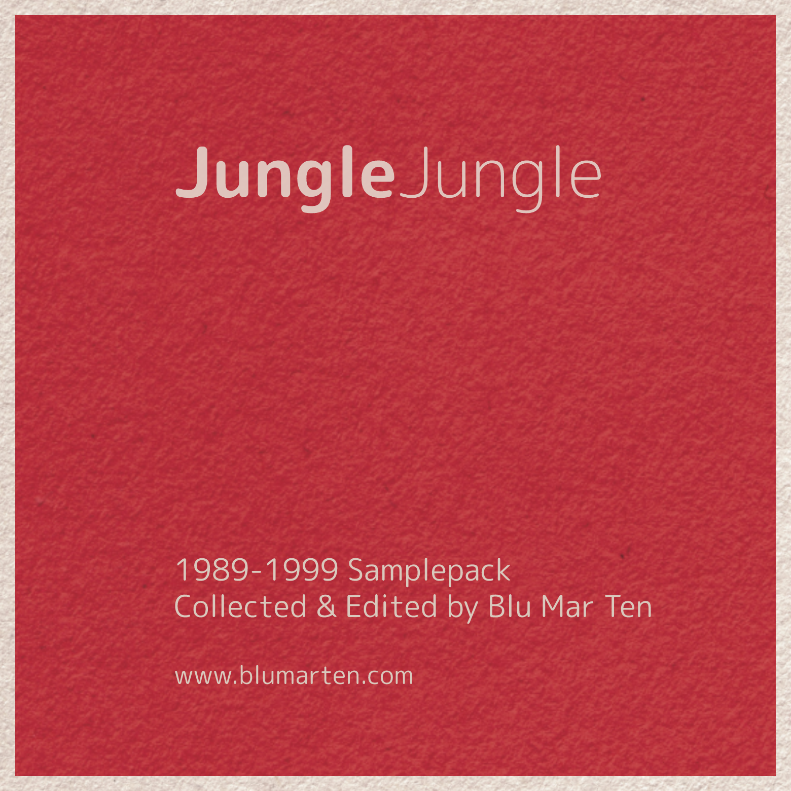

# Jungle Jungle - 1989–1999 Samplepack

## About This Sample Pack

This is the **[Jungle Jungle - 1989–1999 Samplepack](https://blumarten.bandcamp.com/)** originally created by **[Blu Mar Ten](http://www.blumarten.com/)**. This sound pack has been adapted and shared for educational purposes only.

The original pack is made up of samples taken from tracks in Blu Mar Ten's record collections. 

> "It started as a bit of fun to kill time in between proper music work and suddenly became quite large, so it seemed a shame not to share it." — Blu Mar Ten

> "If you're not already familiar with how drum & bass came into being, we encourage you to go back in time and explore the history. There's some amazing music waiting for you there." — Blu Mar Ten

## Pack Details

- **Size**: 390mb
- **Contents**: 650+ breaks, basses, pads, riffs, hits, vocals & FX
- **Format**: All samples taken from vinyl or CD and saved as 16-bit WAVs
- **Quality**: No mp3s were involved at any point in the process
- **Processing**: All samples are cropped & normalised
- **Time Period**: The earliest sample in the pack is from 1989 and the latest is from 1999

## Disclaimers

- These are all samples (or samples of samples) from commercially released tracks. Use them in your productions at your own risk.
- This sample pack is shared for educational purposes only. The original creators (Blu Mar Ten) nor the repository owner do not own any rights to these samples.
- Please don't contact us asking if or how you can get licences to use these samples, or to ask us for the sample sources. We won't reply to you, sorry.

## Usage Guidelines

- This pack was created for fun and is not to be sold
- Use these samples in your productions at your own risk
- If you want to share the sample pack, point people at [blumarten.bandcamp.com](https://blumarten.bandcamp.com)

## Original Source

- **Original Creator**: [Blu Mar Ten](http://www.blumarten.com/)
- **Original Pack**: Available at [blumarten.bandcamp.com](https://blumarten.bandcamp.com/)